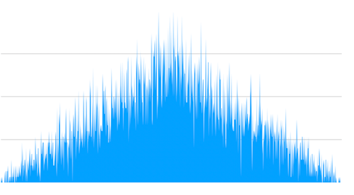

Простой способ получить неравномерное распределение случайных чисел
preview Среднее из двух рандомных значений — простой способ получить неравномерное распределение с пиком посередине.

```javascript
(rand() + rand()) / 2
```

Среднее из двух рандомных значений — простой способ получить неравномерное распределение с пиком посередине.

На графике — пример такого распределения (10,000 семплов 0..1000).


