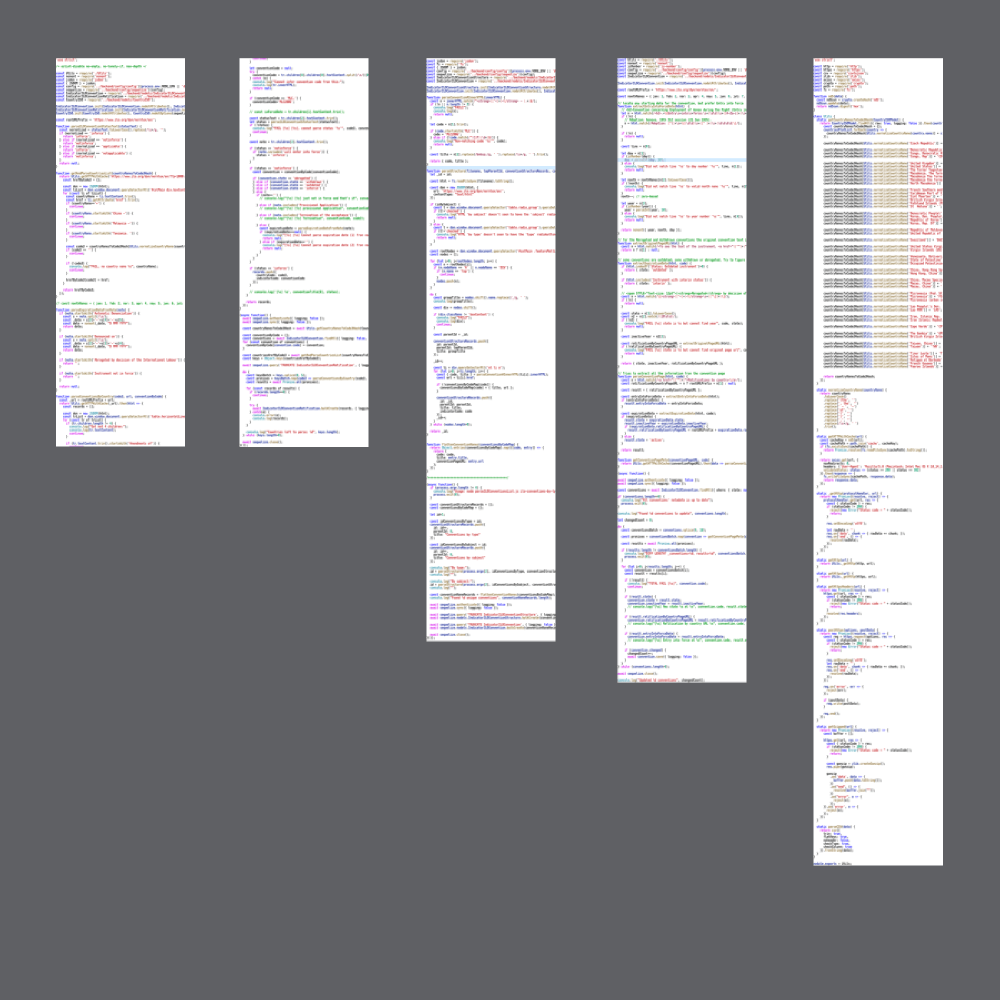

Нормализация парсинга

Когда парсишь CSV-файлы или строковые значения из внешнего мира, обрати внимание, что человеческие надписи будут внезапно меняться.

Например, столбец в CSVшке раньше назывался 'App&nbsp;Id', а сегодня — 'App&nbsp;ID'. Просто кто-то решил, что красиво будет айди написать прописными буквами. Кто-то случайно вставил еще один пробел и, конечно же, не видит его. Кто-то заменил # на №. Кто-то увидел, что грамотно будет писать через запятую. И так далее. В конце концов, это же заголовок для человека, а не для кода.

Если твой парсер рассчитывает найти столбец 'App&nbsp;Id' — он жестко сломается, а за ним и разбор статистики, а за ней отчетность, а за ней апокалипсис.

Правильно делать нормализацию. Все полученные человеческие строки следует приводить к единому виду. В таком случае у тебя остается шанс поймать все вариации, а парсер будет корректно работать не только сегодня:

* lower case
* заменяем все знаки препинания на пробел
* заменяем все цепочки whitespace на один пробел
* обрезаем пробелы по сторонам

И для самых злых случаев:

* убираем артикли
* сортируем слова

Такой подход стоит применять почаще. Скажем, я нередко встречаю ситуацию, когда ошибки из API возвращаются в виде человеческих строк, а не кодов — их категорически нельзя просто втупую сравнивать с эталонными.

На картинке: вот столько кода занимает парсер .csv списка стран, ратифицировавших конвенции ООН. Это очень простая табличка Страна-Конвенция-Ратифицировала-Год, но ее публикуют люди для людей и это кошмар.

