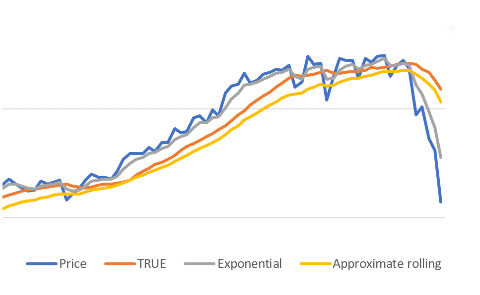

Moving Average для чайников

Стоит чаще пользоваться скользящими средними значениями (по-русски Moving Average) вместо точных цифр.

Например, не имеет смысла рисовать на графике точное количество пользователей сайта на каждый день. Полезнее нарисовать график _среднего количества за последние семь дней_. То есть на каждый день в графике мы рисуем сколько в среднем было за неделю. Так мы видим более сглаженную картинку и тренды.

И вот часто так бывает, что считать настоящее среднее значение - дорого. Ну окей, для графика пользователей легко, а вот попробуй вычислить среднее значение цены акции. На двести бумаг. На трех биржах. На каждый тик.

И тут на помощь приходят методы аппроксимации среднего значения, дешевые по процессору и по памяти. Два метода, которые мне нравятся больше всего:

```javascript
// метод 1
const ALPHA = 0.4;
function calcExponentialMA(accumulator, value) {
  return accumulator + ALPHA * (value - accumulator);
}

// метод 2
function calcApproximateRollingAvg(accumulator, value, count) {
  accumulator -= accumulator / count;
  accumulator += value / count;

  return accumulator;
}
```

Вот как выглядит среднесуточная цена акции Apple _за 10 дней_ в этих двух алгоритмах:



("TRUE" — настоящее среднее, посчитанное втупую).

Самое неприятное в первом методе: правильно подобрать ALPHA. И еще: этот метод вычисляет среднее за все время, но чем старше значение, тем меньше оно влияет на результат. Немного тяжко для осмысления в конкретных числах.

Самое неприятное во втором методе: быстро накапливается ошибка округления. Проверь перед использованием.

Самое неприятное вообще: акции падают. :-(