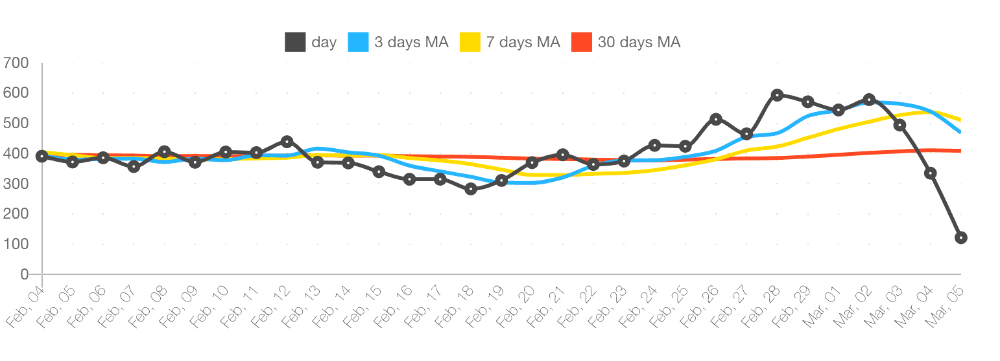

Moving Average в реальной жизни

Представим себе сервис, в котором ты мониторишь количество активных пользователей. Точное значение на конкретный день обычно не имеет смысла. Сильно важнее наблюдать тренды. Например, краткосрочные: мы выкатили апдейт, как выглядит кривая пользователей за неделю? Или среднесрочные: мы уже два месяца предоставляем скидки, как это повлияло на подписки?

Для таких трендов мы используем MA. Каждый день мы вычисляем сколько было в среднем активных пользователей за последние X дней и это число рисуем на графике. И так — на каждый день. И на одном графике важно наложить как минимум две линии: краткосрочную и долгосрочную. Самые интересные вещи происходят на пересечении кратко и долгосрочных трендов.

MA имеет смысл использовать практически для всех графиков и метрик, где ты привык использовать абсолютные числа. Нагрузка на сервис, количество писем в суппорт, денег, подписок, отказов — практически все это имеет смысл рассматривать не в виде абсолютных чисел, а в виде MA.

На картинке: пример такого графика по количеству отказных пользователей в живой системе. Мы что-то сделали правильно :)
